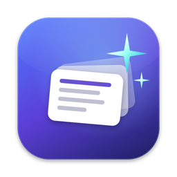
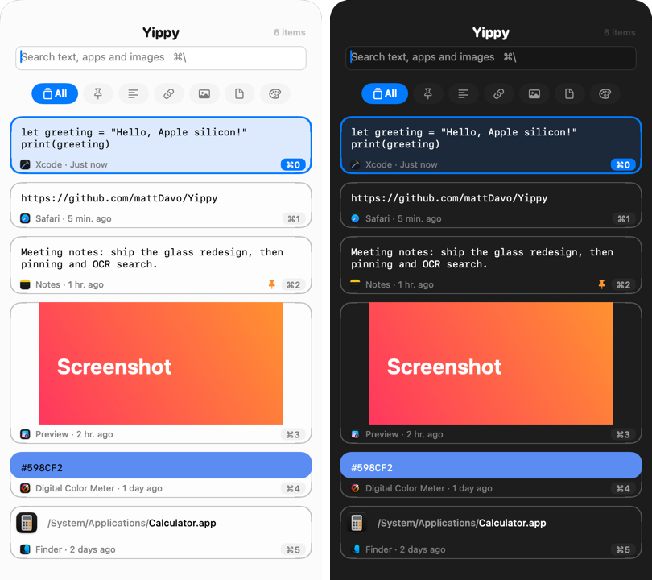

<p align="center"></p>

# Magpie

A fast, keyboard-first clipboard manager for macOS. Magpie keeps everything you copy (text, links, images, files and colours) and gets any of it back in a couple of keystrokes.

<p align="center"></p>

## Features

- **Native on Apple silicon**, with a Liquid Glass panel that slides in from any screen edge or floats in the centre
- **Pinned items** that are never trimmed from history and survive Clear History (⌘P)
- **Filters** for pinned items, text, code, links, images, files and colours (⌘← / ⌘→), plus automatic **tags** for code languages, emails, phone numbers and addresses
- **Code detection** with the language (Swift, Python, JavaScript, TypeScript, Shell, SQL, HTML, CSS, JSON, Go, Rust, C/C++, Java), and **colour detection** for `#hex`, `rgb()` and `hsl()` text
- **Storage overview** showing space used by type and the largest items, with unlimited history available
- **Ranked search** across text, file names, the app something was copied from, and **text inside images**, recognised on-device with Vision
- **Source app and time** shown on every item
- **Paste as plain text** (⌥↩). For images, this pastes the recognised text
- **Excluded apps**: nothing copied from them is saved. Password managers are excluded by default, and anything an app marks as a password or temporary is never saved
- **Right-click actions**: paste, paste as plain text, pin, preview, copy recognised text, open link, show in Finder, delete

## Privacy

Clipboard history is sensitive, so Magpie keeps it on your Mac:

- **No network access.** Magpie makes no network requests: no analytics, no update checks, no link previews. A test (`PrivacyTests`) fails the build if networking APIs are ever added to the app.
- **On-device processing.** Text recognition in images (Vision), code and colour detection, and tagging all run locally.
- **Stored locally.** History lives in a SwiftData store in `~/Library/Application Support/com.sandcheeeez.Magpie`. There is no sync yet; if iCloud sync is added, it will only ever use your own iCloud account.
- **Sensitive copies are skipped.** Items that apps mark as passwords or temporary (`org.nspasteboard.ConcealedType` and similar) are never saved, and nothing is saved from excluded apps (password managers by default; configurable in Settings → Privacy).

## Using your clipboard with AI assistants (MCP)

Magpie includes a local [MCP](https://modelcontextprotocol.io) server, so assistants such as Claude Code can list, search and read your clipboard history. It's **off by default**:

1. Turn on **Settings → Privacy → Let AI assistants read your history**.
2. Connect Claude Code:
   ```
   claude mcp add magpie -- /Applications/Magpie.app/Contents/MacOS/Magpie --mcp
   ```

The server runs only when an assistant launches it, talks to it over stdin/stdout (no network port), opens the history read-only, and can only return what Magpie saved. Excluded apps and password copies are never saved. Tools: `list_clipboard_history`, `search_clipboard_history`, `get_clipboard_item`.

## Keyboard shortcuts

| Action | Shortcut |
| --- | --- |
| Show / hide Magpie | ⇧⌘V (configurable) |
| Paste selected item | ↩ |
| Paste as plain text | ⌥↩ |
| Paste item 0–9 | ⌘0 – ⌘9 |
| Pin / unpin | ⌘P |
| Previous / next filter | ⌘← / ⌘→ |
| Search | ⌘\\ |
| Preview | ⌃Space |
| Delete | ⌃⌫ |
| Move panel | ⌃⌥⌘ + arrow |

## Requirements

- macOS 26 or later
- Accessibility access, which Magpie needs in order to paste into other apps

## Building

1. Install [Xcode](https://developer.apple.com/xcode/).
2. Open `Magpie.xcodeproj` and run the **Magpie** scheme. The only dependency, [HotKey](https://github.com/mattDavo/HotKey), is fetched by Swift Package Manager.

To sign your own builds, set your team under Signing & Capabilities.


### Build configurations

- **Release / Debug**: the app (`com.sandcheeeez.Magpie`)
- **Beta Release / Beta Debug**: a beta build with its own bundle id, orange icon and data
- **XCTest**: tests and development tooling, with its own bundle id so they never touch your real history

To render the UI with sample data into PNGs without touching your real history, run the XCTest build with `--snapshot=<output dir>`.

### Tests

Run the unit tests from Xcode with the **Magpie XCTest** scheme (⌘U), or from the command line:

```
xcodebuild -project Magpie.xcodeproj -scheme "Magpie XCTest" -destination 'platform=macOS' test -only-testing:MagpieTests
```

History tests use an in-memory SwiftData store, so they never touch real data. The UI tests (`MagpieUITests`) predate the redesign and haven't been updated yet.

### Regenerating the icon

The app icon is drawn in code: `swift tools/make-icon.swift Magpie/Resources/Assets.xcassets/AppIcon.appiconset` (add `beta` for the beta icon).

## Roadmap

- [x] Replace RxSwift with Swift Observation and async/await
- [x] Move history storage to SwiftData
- [ ] iCloud sync of history and pins
- [x] Rename the Xcode project and types from Yippy to Magpie
- [ ] Signed and notarised releases

## Credits

Magpie is a fork of [Yippy](https://github.com/mattDavo/Yippy) by Matthew Davidson, used under the MIT License. See [LICENSE](LICENSE).
