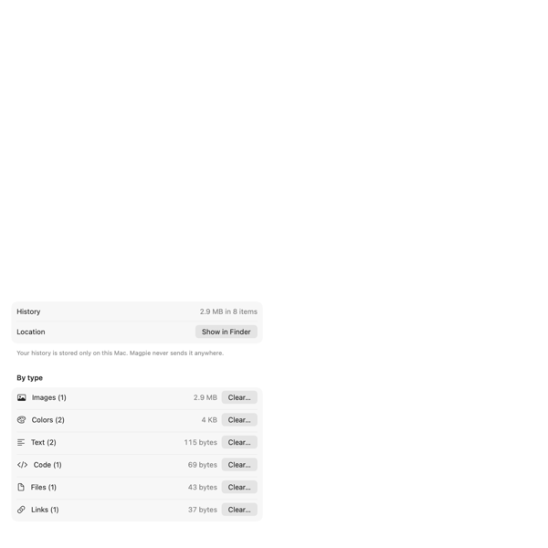

<p align="center"></p>

<h1 align="center">Magpie</h1>

<p align="center">A fast, keyboard-first clipboard manager for macOS that keeps your history private.</p>

Magpie remembers everything you copy (text, code, links, images, files and colours) and gets any of it back in a couple of keystrokes. It understands what you copied: it recognises code and its language, colours written as text, phone numbers and emails, and the text inside screenshots. So you can find things by what they are, not just when you copied them. Everything stays on your Mac.

<p align="center"></p>

## Features

### Find anything you copied
- **Ranked search** across text, file names, the app something came from, and **text inside images**, recognised on-device. Exact matches come first, then close matches, so abbreviations and missing letters still find things.
- **Filters** for pinned items, text, code, links, images, files and colours. Switch between them with ⌘← / ⌘→.
- **Automatic tags** for code languages, emails, phone numbers and addresses, listed with counts in the Tags menu.
- **Source app, time and size** on every item: "Xcode · Just now · Swift, 3 lines", or "Messages · 2 min. ago · 47 characters".

### It knows what you copied
- **Code detection** with the language: Swift, Python, JavaScript, TypeScript, Shell, SQL, HTML, CSS, JSON, Go, Rust, C/C++ and Java.
- **Colours from text.** `#598CF2`, `rgb(89, 140, 242)` and `hsl(220, 85%, 65%)` show as swatches, not just text.
- **Text in screenshots** is recognised with Apple's Vision framework, entirely on-device, so a copied screenshot can be found by its words.

### Paste it back
- **↩** pastes into the app you were using, and **⌘0–⌘9** paste the first ten items directly.
- **Paste as plain text** (⌥↩) drops formatting. For a screenshot, it pastes the recognised text.
- **Right-click** for more: paste as plain text, pin, preview, copy recognised text, open link, show in Finder, delete.

### Keep what matters
- **Pins** (⌘P) keep items forever: they're never trimmed and they survive Clear History.
- **History size** from 50 items to **unlimited**.
- **Storage overview** showing space used by each type and the largest items, with one-click clean-up.

<p align="center"></p>

### Built for macOS 26
- A **Liquid Glass** panel that slides in from any screen edge, or floats in the centre of the screen.
- Native on Apple silicon, light and dark mode, and support for Reduce Motion.

## Privacy

Clipboard history is some of the most sensitive data on your Mac, so Magpie is designed to keep it there:

- **No network access.** Magpie makes no network requests: no analytics, no update checks, no link previews. A test (`PrivacyTests`) fails the build if networking APIs are ever added to the app.
- **On-device processing.** Text recognition, code and colour detection, and tagging all run locally.
- **Stored locally.** Your history lives in `~/Library/Application Support/com.sandcheeeez.Magpie`. There is no sync. If iCloud sync is added, it will only ever use your own iCloud account.
- **Sensitive copies are skipped.** Anything an app marks as a password or temporary (such as `org.nspasteboard.ConcealedType`) is never saved. Nothing is saved from excluded apps: password managers by default, and any app you add in **Settings → Privacy**.

## Use your clipboard with AI assistants (MCP)

Magpie includes a local [MCP](https://modelcontextprotocol.io) server, so assistants like Claude can find things you copied: "use the error I just copied", "what was the address in that screenshot?". It's **off by default**.

1. Turn on **Settings → Privacy → Let AI assistants read your history**.
2. Connect your assistant:
   - **Claude Code:**
     ```
     claude mcp add magpie -- /Applications/Magpie.app/Contents/MacOS/Magpie --mcp
     ```
   - **Claude desktop app (chats):** add this to `~/Library/Application Support/Claude/claude_desktop_config.json`, then restart Claude:
     ```json
     {
       "mcpServers": {
         "magpie": { "command": "/Applications/Magpie.app/Contents/MacOS/Magpie", "args": ["--mcp"] }
       }
     }
     ```

| Tool | What it does |
| --- | --- |
| `list_clipboard_history` | Recent items, newest first. Filter by kind, tag or pinned. |
| `search_clipboard_history` | Search text, text in images, and source apps. |
| `get_clipboard_item` | An item's full content, optionally with the image. |

The server only runs when an assistant launches it. It talks to that assistant over stdin/stdout (it never opens a network port), opens your history read-only, and can only return what Magpie saved, which never includes excluded apps or password copies. Turning the setting off stops all access immediately. Web and mobile assistants can't use it, because they only support MCP servers on the internet.

## Keyboard shortcuts

| Action | Shortcut |
| --- | --- |
| Show / hide Magpie | ⇧⌘V (configurable) |
| Paste selected item | ↩ |
| Paste as plain text | ⌥↩ |
| Paste item 0–9 | ⌘0 – ⌘9 |
| Pin / unpin | ⌘P |
| Previous / next filter | ⌘← / ⌘→ |
| Search | ⌘\\ |
| Preview | ⌃Space |
| Delete | ⌃⌫ |
| Move panel | ⌃⌥⌘ + arrow |
| Close | ⎋ |

## Settings

| Tab | What's there |
| --- | --- |
| **General** | Open at login, panel position, history size (up to unlimited), formatting |
| **Shortcuts** | Change the show/hide shortcut, and a reference of every shortcut |
| **Privacy** | Excluded apps, and assistant (MCP) access |
| **Storage** | Space used, usage by type, the largest items, and clean-up |

## Install

Magpie doesn't have a downloadable release yet (see the [roadmap](#roadmap)). To build it yourself:

1. Install [Xcode](https://developer.apple.com/xcode/) on a Mac running **macOS 26 or later**.
2. Clone this repository, open `Magpie.xcodeproj`, and under **Signing & Capabilities** choose your team. A free Apple account works.
3. Choose **Product → Archive**, or just run the **Magpie** scheme, and move `Magpie.app` to Applications.
4. Open Magpie and allow **Accessibility** access when asked (System Settings → Privacy & Security → Accessibility). Magpie needs it to paste into other apps.

Signing with your own team keeps the Accessibility permission when you update. Unsigned builds have to be approved again after each rebuild.

## Development

### How it's built

- **Swift**, with the panel in AppKit (`NSTableView`, for speed and global hotkeys) and Settings in SwiftUI.
- **State** is an `@Observable` `AppState`. AppKit reacts through a small `observe { } onChange:` helper built on Observation.
- **History** is stored with **SwiftData** (`ClipItem`, and `ClipRepresentation` for each pasteboard type). Large data such as images uses external storage.
- **`ClipAnalyzer`** classifies content when it's copied: kind, code language, colour, tags and counts. When detection improves, stored items are analysed again.
- **`MCPServer`** runs when the app is launched with `--mcp`.
- The only dependency is [HotKey](https://github.com/mattDavo/HotKey), fetched by Swift Package Manager.

Design notes and progress are kept in [docs/ARCHITECTURE_PLAN.md](docs/ARCHITECTURE_PLAN.md).

### Build configurations

- **Release / Debug**: the app (`com.sandcheeeez.Magpie`)
- **Beta Release / Beta Debug**: a beta build with its own bundle id, orange icon and data
- **XCTest**: tests and development tools, with its own bundle id, so they never touch your real history

### Tests

Run the unit tests in Xcode with the **Magpie XCTest** scheme (⌘U), or:

```
xcodebuild -project Magpie.xcodeproj -scheme "Magpie XCTest" -destination 'platform=macOS' test -only-testing:MagpieTests
```

They cover history storage (against an in-memory store), search ranking, content analysis, settings, the MCP server, and the no-network guarantee.

UI tests (`MagpieUITests`) drive the app with the mouse and keyboard, so run them when you aren't using the Mac. Quit your own Magpie first, because both would claim ⇧⌘V. They seed their own history and never touch yours, but they do change the clipboard.

### Screenshots and icon

- `Magpie --snapshot=<dir>`, in the XCTest build, renders the panel and settings with sample data into PNGs. The images in this README were made that way.
- The app icon is drawn in code: `swift tools/make-icon.swift Magpie/Resources/Assets.xcassets/AppIcon.appiconset` (add `beta` for the beta icon).

## Roadmap

- [ ] Signed and notarised releases, so Magpie can be downloaded and opened without building it
- [ ] Optional iCloud sync of history and pins, using only your own iCloud account
- [ ] Run and stabilise the UI test suite
- [x] Content analysis: code languages, colours from text, and tags
- [x] Storage overview and unlimited history
- [x] Local MCP server for AI assistants
- [x] SwiftData storage and Swift Observation, replacing file storage and RxSwift
- [x] Apple silicon native, macOS 26 redesign

## Credits

Magpie is a fork of [Yippy](https://github.com/mattDavo/Yippy) by Matthew Davidson, used under the MIT License. See [LICENSE](LICENSE).
